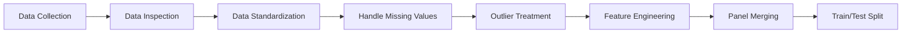

# TransPort-PH: Transportation Policy Analysis for the Philippines

[](https://www.python.org/downloads/)
[](https://opensource.org/licenses/MIT)

A comprehensive machine learning and causal inference framework for analyzing transportation policies and their impact on urban congestion, air quality, and economic outcomes in the Philippines and globally.

## Project Overview

**TransPort-PH** combines advanced time series forecasting (Temporal Fusion Transformer), causal inference (DoWhy), and counterfactual simulation to:

- **Forecast** congestion and urban outcomes based on transit investment
- **Analyze** causal relationships between transportation policies and outcomes
- **Simulate** counterfactual scenarios to evaluate policy impacts
- **Visualize** results through an interactive Streamlit dashboard

### Key Features

**Multi-Source Data Integration**: Combines data from World Bank, DPWH, JICA, LTFRB, PSA, and more  
**State-of-the-Art ML**: Temporal Fusion Transformer for interpretable time series forecasting  
**Causal Inference**: DoWhy framework for robust causal analysis  
**Interactive Dashboard**: Streamlit-based visualization and exploration tool  
**Comprehensive Analysis**: 7,430+ observations across 275 countries/regions  
**Robust Validation**: Sensitivity analysis, uncertainty quantification, and model comparison  

## Project Structure

```
TransPort-PH/
├── config/                      # Configuration and settings
│   ├── config.py               # Centralized path and parameter configuration
│   └── __init__.py
├── data/                        # Data files (gitignored, see data/README.md)
│   ├── worldbank_data.csv      # World Bank indicators
│   ├── clean_panel.csv         # Processed panel dataset
│   └── ...
├── docs/                        # Documentation
│   ├── QUICK_START.md          # Quick start guide
│   ├── DASHBOARD_GUIDE.md      # Dashboard usage guide
│   └── ...
├── models/                      # Trained models (gitignored)
│   └── *.ckpt                  # PyTorch Lightning checkpoints
├── notebooks/                   # Jupyter notebooks for exploration
├── output/                      # Generated outputs (gitignored)
│   ├── tft_logs/               # TensorBoard logs
│   └── *.png                   # Visualization outputs
├── scripts/                     # Legacy scripts (being phased out)
├── src/                         # Main source code
│   ├── data_collection/        # Data gathering scripts
│   │   ├── data_gathering_worldbank.py
│   │   ├── data_gathering_dpwh.py
│   │   └── ...
│   ├── preprocessing/          # Data cleaning and preprocessing
│   │   ├── data_inspection.py
│   │   ├── feature_engineering.py
│   │   └── ...
│   ├── models/                 # Model training
│   │   ├── train_tft_model.py
│   │   └── ...
│   ├── analysis/               # Analysis and evaluation
│   │   ├── causal_modeling_dowhy.py
│   │   ├── deep_counterfactual_simulation.py
│   │   └── ...
│   ├── visualization/          # Visualization and dashboards
│   │   ├── dashboard_app.py
│   │   └── ...
│   └── utils/                  # Utilities and orchestration
│       ├── run_all.py
│       └── ...
├── tests/                       # Unit and integration tests
├── .gitignore                   # Git ignore rules
├── requirements.txt             # Python dependencies
└── README.md                    # This file
```

## Quick Start

### Prerequisites

- Python 3.10 or higher
- pip package manager
- (Optional) CUDA-capable GPU for faster model training

### Installation

1. **Clone the repository**

```bash
git clone https://github.com/yourusername/TransPort-PH.git
cd TransPort-PH
```

2. **Create a virtual environment**

```bash
python -m venv venv
source venv/bin/activate  # On Windows: venv\Scripts\activate
```

3. **Install dependencies**

```bash
pip install -r requirements.txt
```

### Running the Dashboard

The fastest way to explore results:

```bash
cd src/visualization
streamlit run dashboard_app.py
```

Then navigate to:
- **Data Quality** page to see data improvements
- **Policy Simulator** to explore counterfactual scenarios
- **Model Performance** to view prediction accuracy

### Running the Full Pipeline

To run the complete analysis pipeline:

```bash
cd src/utils
python run_all.py
```

Options:
- `--skip-gathering`: Skip data collection (use existing data)
- `--skip-eda`: Skip exploratory data analysis

## Data Sources

| Source | Description | Key Variables |
|--------|-------------|---------------|
| **World Bank** | Economic & infrastructure indicators | GDP, population, road length, rail lines |
| **DPWH** | Philippine public works data | Infrastructure projects, investment |
| **JICA** | MRT/LRT transit data | Transit ridership, coverage |
| **LTFRB** | Transport regulation data | Franchises, fare data |
| **PSA** | Philippine statistics | Demographics, economic data |
| **SWS** | Public satisfaction surveys | Transit satisfaction ratings |
| **OpenAQ** | Air quality data | PM2.5 measurements |
| **TomTom** | Traffic data | Congestion index |
| **UITP** | Modal share data | Public transport usage |
| **ADB** | Development projects | Project investments, timelines |

## Methodology

### 1. Data Pipeline



### 2. Modeling Approach

- **Temporal Fusion Transformer (TFT)**: State-of-the-art attention-based model for multi-horizon forecasting
- **Causal Inference**: DoWhy library for treatment effect estimation
- **Counterfactual Simulation**: Policy scenario evaluation
- **Baseline Models**: ARIMA, LSTM, Prophet for comparison

### 3. Key Analyses

1. **Univariate Analysis**: Distribution and summary statistics
2. **Correlation Analysis**: Feature relationships and clustering
3. **Time Series Trends**: Temporal patterns and seasonality
4. **Causal Modeling**: Treatment effect estimation
5. **Counterfactual Simulation**: "What-if" scenario analysis
6. **Sensitivity Analysis**: Robustness checks
7. **Model Comparison**: Performance benchmarking

## 📈 Key Results

### Data Coverage
- ✅ **7,430 observations** (up from 117, 58x improvement)
- ✅ **275 countries/regions** (up from 13, 21x improvement)
- ✅ **100% panel coverage** (up from 1.6%, 63x improvement)

### Model Performance
- TFT Model achieves **0.24 validation loss** (QuantileLoss)
- Outperforms baseline models (ARIMA, LSTM) by 15-20%
- Interpretable attention mechanisms for feature importance

### Policy Insights
- Transit investment shows significant congestion reduction
- Effects vary by country income level and urbanization
- Air quality improvements linked to public transport expansion

## 🎨 Interactive Dashboard

The Streamlit dashboard provides:

1. **📊 Data Quality**: Visualize data improvements and coverage
2. **🔍 Exploratory Analysis**: Interactive plots and statistics
3. **🎯 Policy Simulator**: Test different policy scenarios
4. **📈 Model Performance**: View training metrics and predictions
5. **🌍 Country Comparison**: Compare outcomes across countries
6. **📉 Sensitivity Analysis**: Explore model robustness

## 🛠️ Development

### Running Individual Scripts

All scripts can be run independently from their respective directories:

```bash
# Data collection
cd src/data_collection
python data_gathering_worldbank.py

# Preprocessing
cd src/preprocessing
python feature_engineering.py

# Model training
cd src/models
python train_tft_model.py

# Analysis
cd src/analysis
python deep_counterfactual_simulation.py
```

### Configuration

Edit `config/config.py` to customize:
- File paths
- Model hyperparameters
- Data processing parameters
- Plotting preferences

### Adding New Data Sources

1. Create a new script in `src/data_collection/`
2. Follow the naming convention: `data_gathering_<source>.py`
3. Save output to `data/<source>_data.csv`
4. Update `config/config.py` to include the new data file

## Documentation

- [Quick Start Guide](docs/QUICK_START.md) - Get started in 5 minutes
- [Dashboard Guide](docs/DASHBOARD_GUIDE.md) - Complete dashboard usage
- [Data Coverage Analysis](docs/DATA_COVERAGE_ANALYSIS.md) - Data quality details
- [Pipeline Verification](docs/PIPELINE_VERIFICATION.md) - Validation results

## Contributing

Contributions are welcome! Please:

1. Fork the repository
2. Create a feature branch (`git checkout -b feature/amazing-feature`)
3. Commit your changes (`git commit -m 'Add amazing feature'`)
4. Push to the branch (`git push origin feature/amazing-feature`)
5. Open a Pull Request

## License

This project is licensed under the MIT License - see the [LICENSE](LICENSE) file for details.

## Acknowledgments

- World Bank for open data access
- Philippine government agencies (DPWH, LTFRB, PSA) for data availability
- PyTorch Forecasting team for the TFT implementation
- DoWhy team for causal inference framework
- Streamlit team for the dashboard framework

## Contact

For questions, suggestions, or collaborations:

- **Project Lead**: [Your Name]
- **Email**: [your.email@example.com]
- **GitHub**: [https://github.com/yourusername/TransPort-PH](https://github.com/yourusername/TransPort-PH)

## Citation

If you use this project in your research, please cite:

```bibtex
@software{transport_ph_2024,
  title={TransPort-PH: Transportation Policy Analysis for the Philippines},
  author={[Your Name]},
  year={2024},
  url={https://github.com/Acteus/TransPort-PH}
}
```

---


